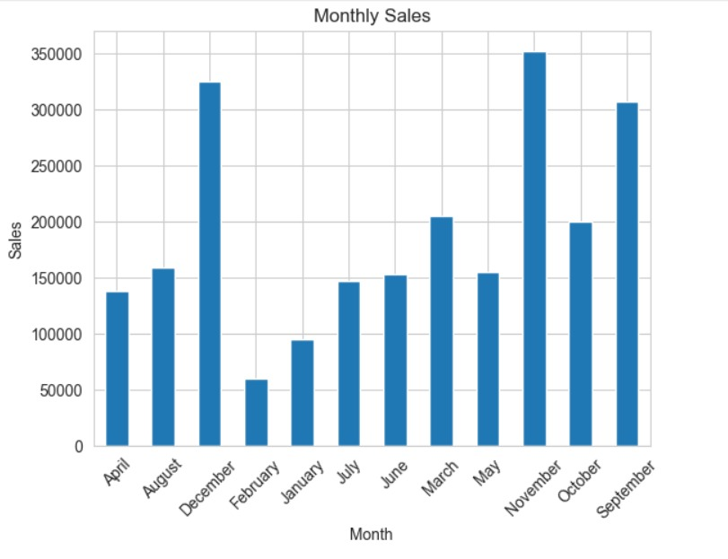
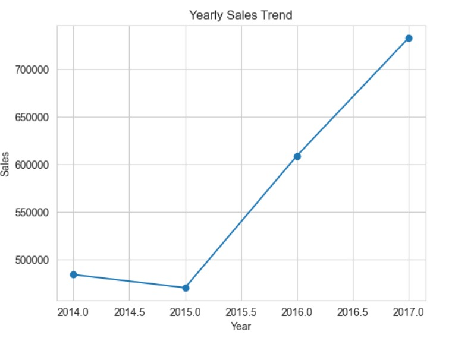
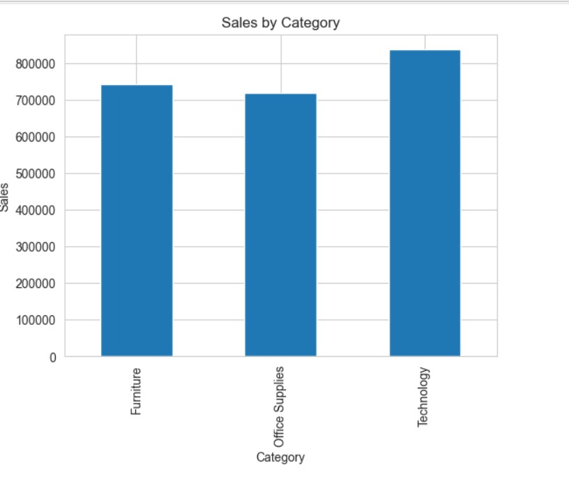
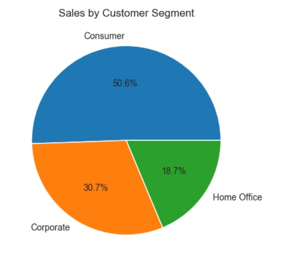
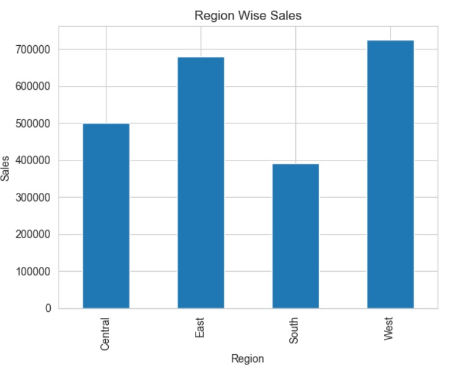
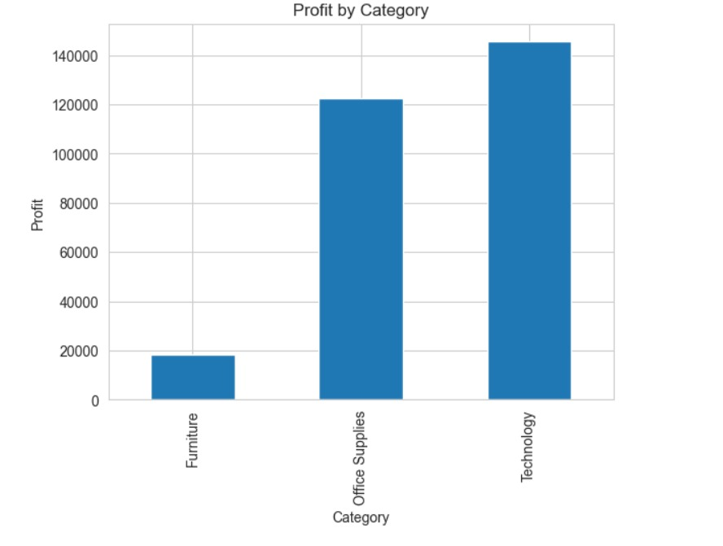
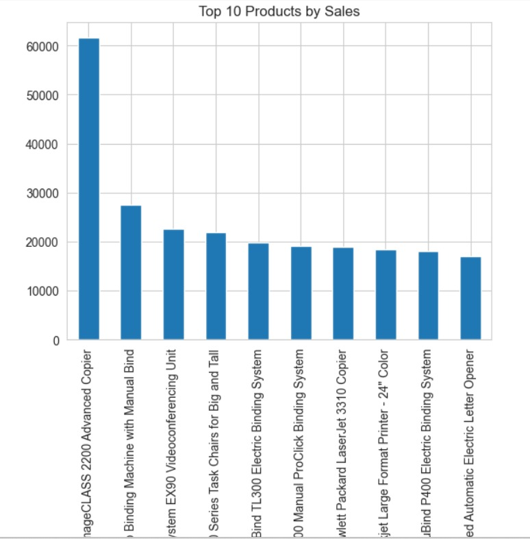
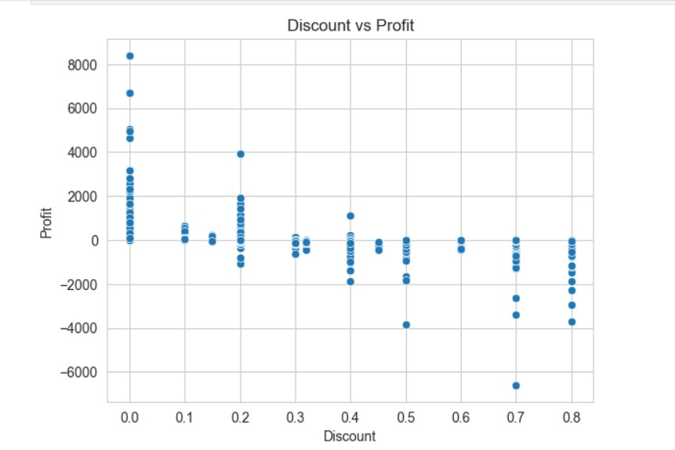
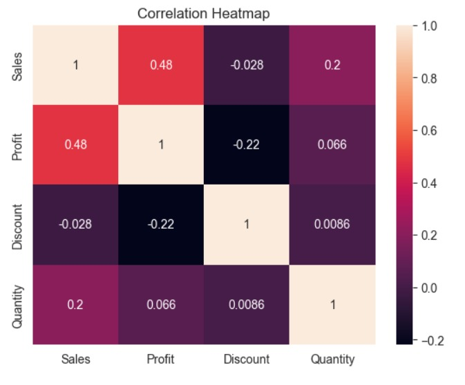

# 📊 Superstore Sales Analysis

## 📌 Project Overview
This project analyzes a retail dataset to understand sales trends, customer segments, product performance, and profitability.

The goal is to extract meaningful business insights that help organizations improve sales strategies and increase profitability.

## 💼 Problem Statement
Businesses often struggle to identify which products, regions, and customer segments drive revenue and profit.

## 🎯 Objective
To analyze sales data and uncover patterns that influence revenue, profitability, and customer behavior.

## 📂 Dataset
The dataset used is the **Superstore dataset**, containing retail transaction data.

- Number of records: 9994  
- Number of columns: 21  

### Key Fields:
- Order Date  
- Customer Name  
- Region  
- Category  
- Sub-Category  
- Sales  
- Profit  
- Discount  

## 🛠️ Tools and Technologies Used
- Python  
- Pandas  
- NumPy  
- Matplotlib  
- Seaborn  
- Jupyter Notebook  

## 🧹 Data Cleaning
- Checked for missing values  
- Removed duplicate records  
- Converted data types where necessary  
- Standardized column names  

## 📊 Exploratory Data Analysis (EDA)
Performed analysis on:
- Sales trends over time  
- Profit distribution  
- Regional performance  
- Customer segments  
- Product categories  

## 📸 Dashboard Preview

## 📊 Visualizations

### 📈 Sales Trends

### 📊 Sales by Category

### 👥 Sales by Customer Segment

### 🌍 Region-wise Sales

### 💰 Profit by Category

### 🔥 Top Products

### 📉 Discount vs Profit

### 🔗 Correlation Heatmap

## 🔍 Key Analysis Performed
- Sales trend analysis over time  
- Sales distribution by category  
- Regional sales performance  
- Customer segment contribution  
- Top selling products  
- Profit vs Discount relationship  

## 🔍 Key Insights
- Technology category generated the highest revenue  
- West region contributed the highest overall sales  
- Consumer segment placed the highest number of orders  
- Higher discounts often resulted in lower profit margins  
- Some products generate high sales but low profit due to excessive discounts  

## 💡 Business Recommendations
- Reduce excessive discounting to improve profit margins  
- Focus marketing efforts on high-performing categories  
- Promote top-selling products strategically  
- Improve performance in low-performing regions  

## 🧠 Skills Demonstrated
- Data Cleaning  
- Exploratory Data Analysis  
- Data Visualization  
- Business Insight Generation  

## 🚀 Conclusion
This project demonstrates how data analysis can help businesses identify opportunities to increase revenue and improve profitability through data-driven decision-making.
